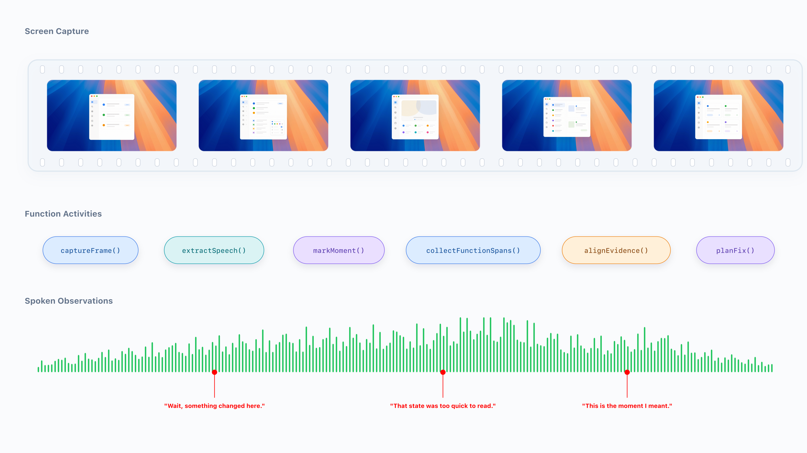
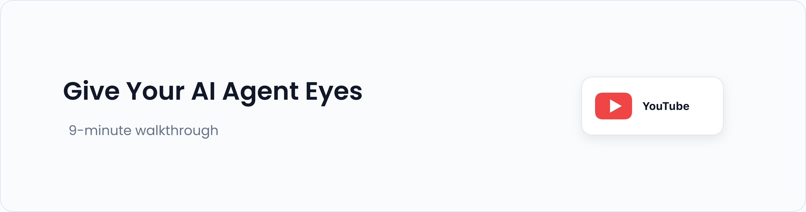
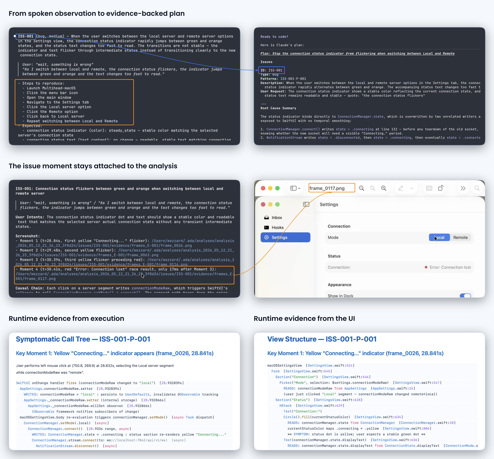

# ReadyCheck

ReadyCheck is the **Human Perception Layer** for AI agents working on running software.

It lets a human use the app naturally, say what feels wrong, and captures the surrounding evidence so an agent can connect that perception to what actually happened underneath.
Instead of asking agents to guess from vague bug reports, isolated screenshots, or incomplete logs, ReadyCheck creates a tight, time-aligned evidence bundle they can summarize, search, and cite:

- **Screen Capture**: what the user saw.
- **Spoken Observations**: what the user noticed and said in the moment.
- **Function Activities**: what the program actually did underneath.

Together, these signals turn human review into agent-readable ground truth.



## Get ReadyCheck

```sh
claude plugin marketplace add readycheck-dev/skills
claude plugin install readycheck@readycheck
```

This installs the **ReadyCheck** plugin from the dedicated ReadyCheck marketplace.
The marketplace ships the lightweight ReadyCheck plugin source directly, and that
plugin is pinned to a published GitHub release of the packaged macOS runtime.

## Use ReadyCheck

**Walkthrough Video:**

[](https://youtu.be/WTj7UkfVGZU)

**Run and Analyze:**

Option A: Enter "check my app" or "check my macOS app" in Claude Code.

Option B: Enter `/check My app` or `/check My macOS app` in Claude Code.

This builds, runs, captures, and automatically analyzes your app.

While the app is running, use it naturally and speak what feels wrong as you notice it, such as "this flicker feels wrong" or "that transition was too fast to read." ReadyCheck keeps those spoken observations aligned with the screen and runtime evidence for the agent.

**Analyze Only:**

Run standalone analysis on an existing session, creating a fix plan.

```shell
/analyze [session_id]
```

## Key Features



## Platform and Language Availabilities

**Supported Platforms and Programming Languages**

| | macOS | iOS | Android | Linux | Windows |
| --- | --- | --- | --- | --- | --- |
| Swift | ✅ | 📋 | 📋 | 📋 | 📋 |
| Objective-C | ✅ | 📋 | 📋 | 📋 | 📋 |
| C | ✅ | 📋 | 📋 | 📋 | 📋 |
| C++ | ✅ | 📋 | 📋 | 📋 | 📋 |
| Rust | ✅ | 📋 | 📋 | 📋 | 📋 |
| Kotlin | 📋 | 📋 | 📋 | 📋 | 📋 |
| Java | 📋 | 📋 | 📋 | 📋 | 📋 |

- ✅: Supported
- ⚠️: Not Tested
- 📋: Planned
- 🚧: Under construction

## Contributing Ideas

For now, ideas are submitted as GitHub issues.

If something feels missing or painful, open an issue with:

- What you were trying to do, what you expected, and what happened instead
- Your platform/version details
- (Optional) A redacted session bundle or screenshots/timestamps

## Contributing Tokens

This project is maintained by AI agents that continuously review contributed ideas and selectively implement them.

If you want to support the project's LLM-related costs (docs, examples, and evaluations), please open an issue to coordinate sponsorship or token contributions.

**Do not post API keys in issues.**

**Contributable Tokens:**

- Anthropic Claude series
- OpenAI GPT series
- Moonshot Kimi K2.6
- DeepSeek V4 series
- Xiaomi Mimo V2.5 Pro

## License

The plugin source code in this repository is licensed under the
[Apache License 2.0](LICENSES/Apache-2.0.txt).

Binary runtime packages downloaded by the plugin are licensed under the
[ReadyCheck Binary Preview License](LICENSES/ReadyCheck-Binary-Preview-License.txt).

Third-party components are listed in [LICENSES/THIRD-PARTY-NOTICES.md](LICENSES/THIRD-PARTY-NOTICES.md).

## Support

For issues or questions, please refer to the documentation or create an issue in the repository.
